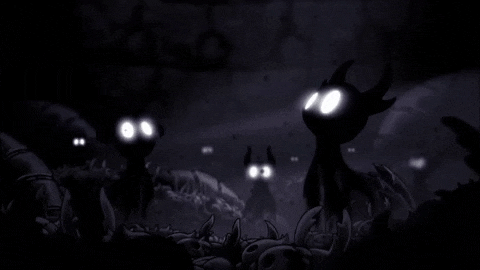
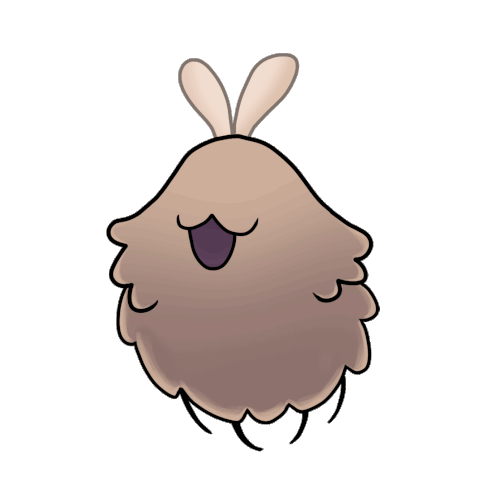
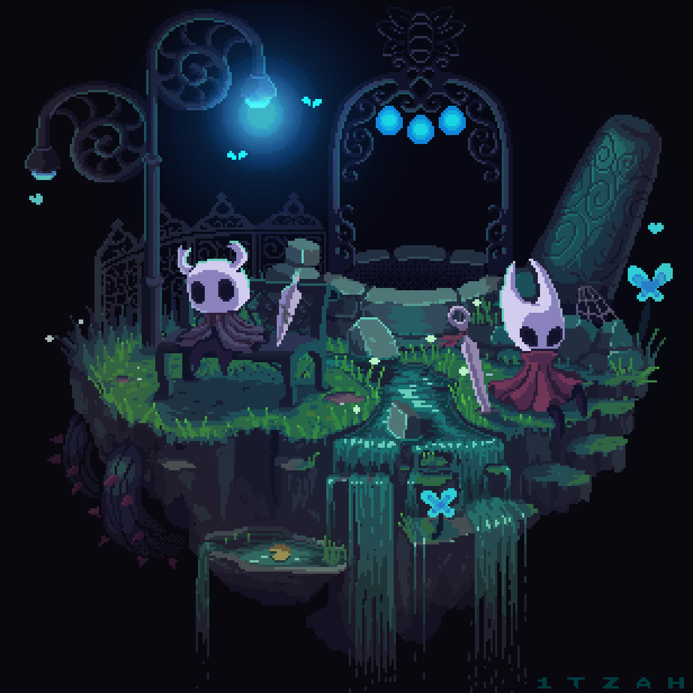
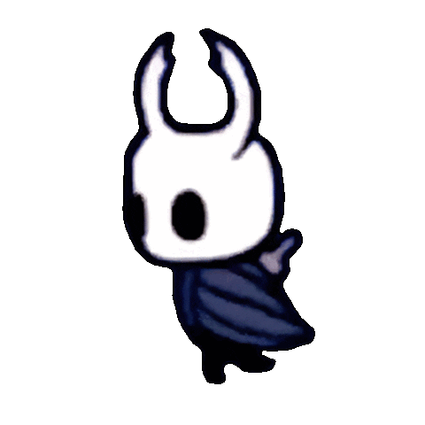

 

<h1>
  👋 Welcome, Traveler
</h1>

 

<h3>
<i>"No cost too great."</i>
</h3>

---

#  About Me

Hi, I'm **Amine TN**.

🎓 Second-year student at **ENSA Agadir** in the **Cycle Préparatoire**.

💻 I enjoy solving programming problems, exploring new technologies, and improving my development skills.

🌱 Currently learning:

- ⚔️ C++
- 🧩 Data Structures & Algorithms
- 🐧 Linux
- 🔧 Git

 

---

# ⚔️ Languages

---

# 🛠 Tools & Environment

---

# 🎮 Beyond Coding

🏋️ **Gym**  
🎮 **Gaming**  
🌌 **Hollow Knight**  
📺 **Anime**  
☕ **Learning something new every day**

---

  
 Thanks for visiting my profile.

