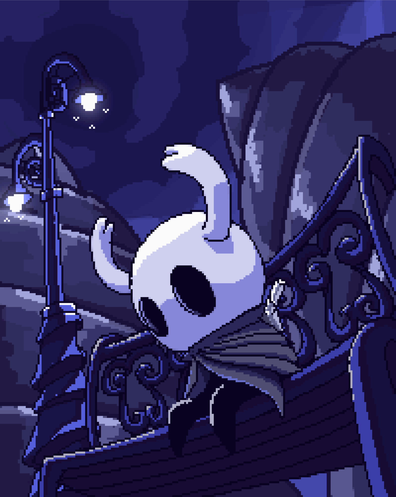

# 👋 Welcome, Traveler

---

# 🌙 About Me

Hi, I'm **Amine TN**.

🎓 Second-year student at **ENSA Agadir** in the **Cycle Préparatoire**.

💻 I enjoy solving programming problems, building projects, and continuously improving my skills.

🌱 Currently focusing on:

- C++
- Data Structures & Algorithms
- Linux
- Git

---

# ⚔️ Languages

---

# 🛠 Technologies

---

# 🎮 Beyond Coding

🏋️ Gym

🎮 Gaming

🌌 Hollow Knight

📺 Anime

☕ Learning something new every day.

---

# 📊 GitHub Stats

---

---

> *"No cost too great."*

⭐ Thanks for visiting my profile.

